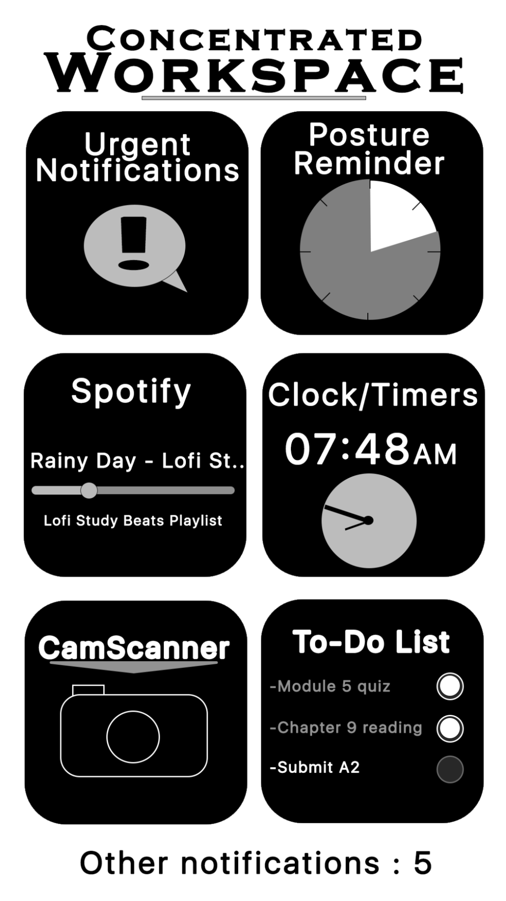
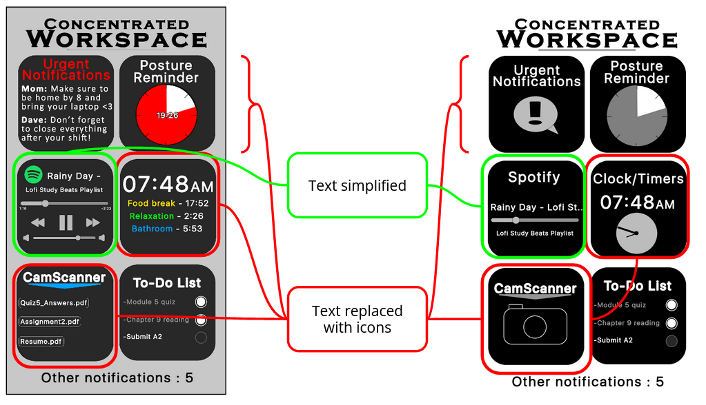
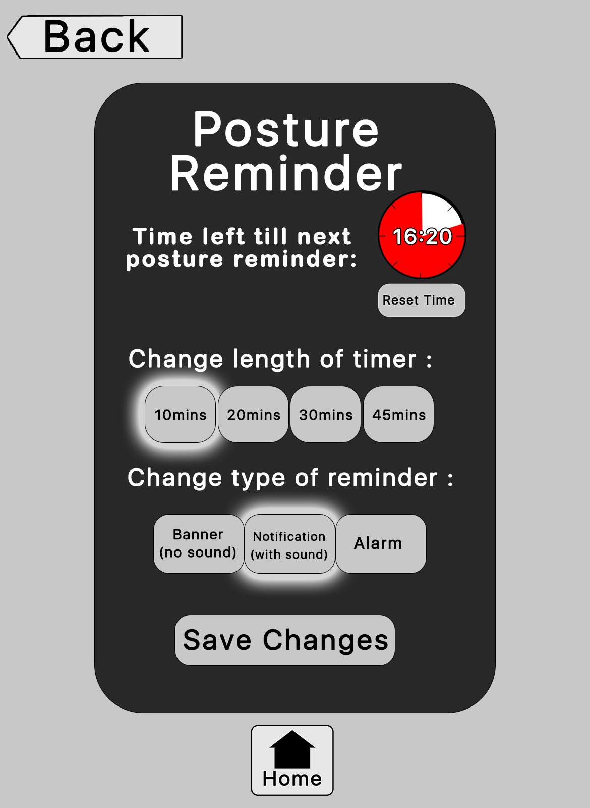
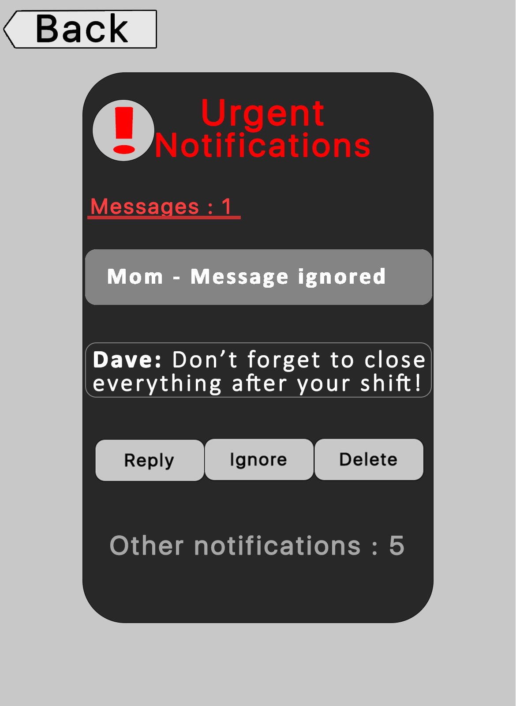
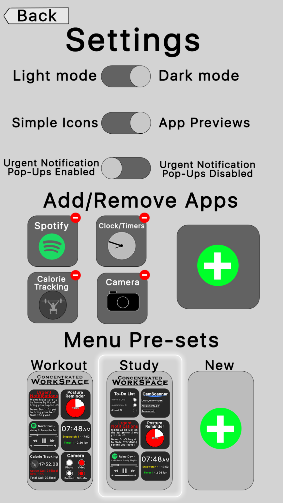
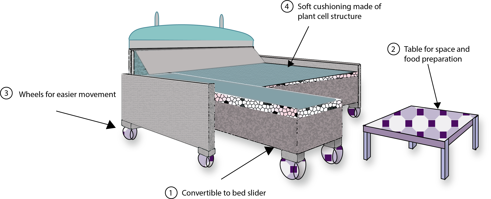

# Intro
This repo covers some of the creative designs that I have created as a group as well as individually. The three designs that I want to showcase are:

- The Poor Posture App Prototypes
- Furniture Design
- Virtual Currency

Check out the case study on my portfolio: https://ashusharma.info/p/e335b56d/034d8ead

---

# Poor Posture App
- Designed extensive prototypes for an app with three group members from the
University of Toronto. The app tackles the issue of individuals suffering from poor
posture and maintaining healthy habits.
- Created low, medium, and high fidelity prototypes in Illustrator and Photoshop.
- Responsible for Prototyping, Usability Testing, User Research, Interaction and
Visual Design, and Information Architecture.
- Collaborated within a team effectively to define and improve designs based on
quantitative and qualitative data.

----
# Furniture Design
- This is one of my designs that I created using Illustrator. It consisted of finding a solution for the lack of comfort and space regarding furniture in hospitals. I completed user research, conceptualized prototypes using visualization skills, and generated an innovative solution in redesigning the furniture using creative methods and design theory.
- One of the observations I have made in a hospital is that visitors are unable to sit comfortably on a single sofa which is only available for one person. Visitors usually stay for a long period of time when visiting patients and they are forced to sit in a small space or stand up with other visitors. It is also difficult for them to sit next to a patient on a bed because there isn’t enough space available.

----

# Virtual Currency Design

- This project was created using Photoshop and Illustrator to conceptualize the design of a virtual currency that plays a role in a fictional world. It involved analyzing case studies of design practitioners, creatively expressing ideas, and researching topics regarding digital currencies.

